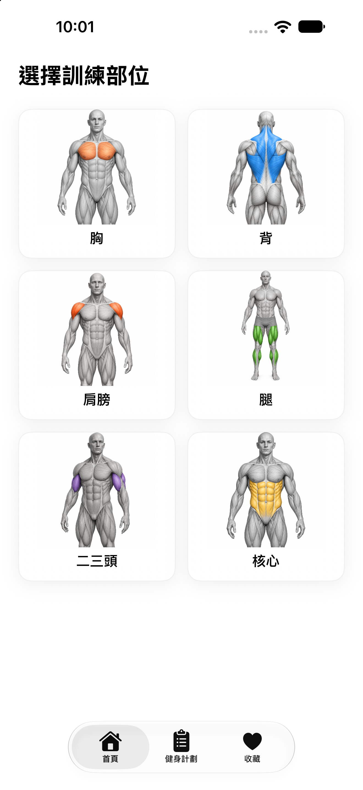
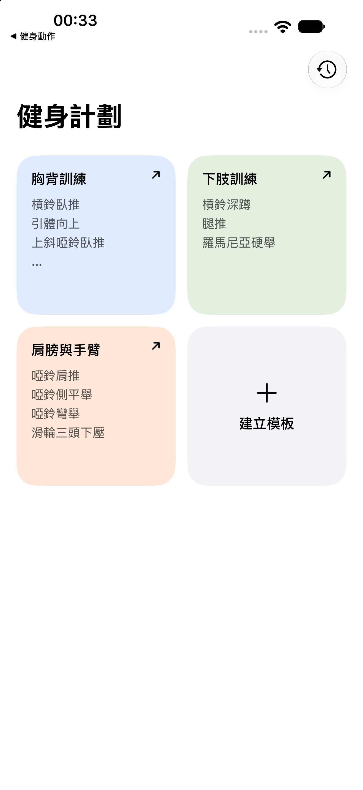
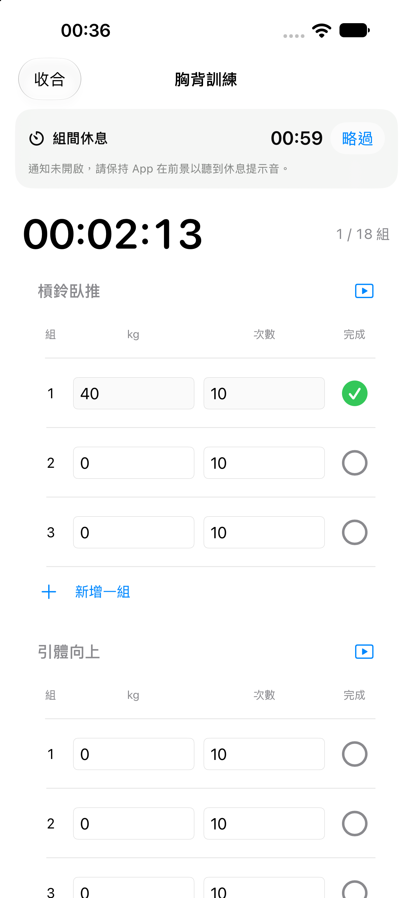

# 健身動作

以 SwiftUI 製作的 iPhone 健身 App，整合動作教學、可重複使用的訓練模板、逐組紀錄與休息計時。資料儲存在本機，不需要帳號、網路或後端服務。

## 畫面預覽

<table>
  <tr>
    <th>動作教學</th>
    <th>訓練模板</th>
    <th>進行中的運動</th>
  </tr>
  <tr>
    <td></td>
    <td></td>
    <td></td>
  </tr>
</table>

截圖取自 iPhone Simulator。模板與運動畫面使用測試資料示範；首次安裝需自行建立模板。

## 功能

### 動作教學

- 胸、背、肩膀、腿、二三頭、核心，共六個部位、60 個動作。
- 各肌群使用不同封面，支援器材篩選。
- 離線 GIF 示範、播放與暫停控制，以及繁體中文教學步驟。
- 可查看器材、主要肌群並收藏動作。

### 健身計劃

- 自行建立模板，從既有動作中選取並拖曳排序。
- 設定每個動作的組數與組間休息時間。
- 模板以圓角正方形卡片呈現，超出卡片的動作以「…」收尾。
- 每次選擇模板開始運動，建立獨立的訓練紀錄。
- 正向計時持續累計運動與休息時間。
- 逐組輸入重量與次數，打勾後開始休息倒數。
- 休息到時播放鈴聲，可手動略過休息。
- 支援收合、繼續運動，以及重開 App 後恢復進度。
- 完成後保存每組紀錄及總時間，模板可再次使用。

### 介面

純白背景、淡色模板卡片與原生 Liquid Glass 分頁列，包含「首頁」「健身計劃」「收藏」。

## 使用方式

1. 在「首頁」選擇肌群，查看動作示範與教學。
2. 開啟「健身計劃」，點選「建立模板」。
3. 輸入模板名稱、加入動作，設定順序、組數與休息秒數後儲存。
4. 選擇模板，點選「開始運動」。
5. 輸入每組重量與次數，完成後打勾；徒手動作可填 `0 kg`。
6. 休息結束後進行下一組，最後選擇「結束運動」儲存紀錄。

右上角的時鐘按鈕可查看歷史紀錄。修改或刪除模板不會影響既有紀錄及進行中的運動。

## 開發與執行

### 環境

- macOS 與支援 iOS 26 或更新版本 SDK 的 Xcode。
- iOS 26 或更新版本的 iPhone／Simulator。
- 資料驗證另需 Python 3 與 Pillow。

### 使用 Xcode

1. 複製儲存庫並開啟 `Week 2.xcodeproj`。
2. 選擇 `Week 2` 執行方案及 iPhone Simulator。
3. 執行專案。

若要安裝至實體 iPhone，請在 Signing & Capabilities 選擇自己的開發團隊，並視需要調整 Bundle Identifier。

### 指令建置

```sh
xcodebuild \
  -project 'Week 2.xcodeproj' \
  -scheme 'Week 2' \
  -configuration Debug \
  -sdk iphonesimulator \
  -derivedDataPath /tmp/fitness-build \
  build
```

## 資料保存與提醒

- 模板、進行中的運動與歷史紀錄存於 App 的 `Application Support/workout-plans.json`。
- 收藏與休息截止時間透過本機設定保存。
- 同一時間僅允許一場運動，避免覆寫尚未結束的訓練。
- 開始、結束或放棄運動時，先以原子寫入保存資料，再切換狀態。
- 資料檔無法解析時會保留原檔，不以空白資料覆寫。
- 刪除 App 會移除本機資料，目前沒有雲端同步。

前景休息鈴聲使用 AVAudioPlayer；背景提醒使用本機通知。首次開始休息時會請求通知權限，背景聲音會受到通知、靜音及專注模式設定影響。

## 驗證

### 動作與媒體資料

```sh
python3 -m pip install Pillow
python3 scripts/verify_exercises.py
```

核對 60 個動作的 ID、順序、六個分類、GIF 影格、縮圖尺寸、原文對應與六張不同封面。

### 模板與訓練資料

```sh
xcrun swiftc -parse-as-library \
  'Week 2/WorkoutPlanStore.swift' \
  scripts/tests/WorkoutPlanChecks.swift \
  -o /tmp/workout-plan-checks
/tmp/workout-plan-checks
```

涵蓋模板保存與排序、獨立訓練、正向計時、進度恢復、歷史紀錄隔離、舊資料相容、數值驗證及損壞檔保護。

另提供 `scripts/tests/WorkoutRuntimeChecks.swift` 作為獨立 Simulator 測試 App 的入口，可驗證休息倒數與 WAV 播放呼叫；它不屬於正式 App 的建置來源。測試時需使用獨立 Bundle Identifier，避免接觸正式資料。

目前已完成 Simulator 建置、資料模型與倒數程式測試，以及 iPhone 畫面檢查。完整點擊／拖曳流程與鎖定畫面的實際響鈴仍需進一步實機驗證；未進行 iPad 驗收。

## 專案結構

```text
Week 2/
├── ContentView.swift          # 分頁與動作教學介面
├── Exercise.swift             # 動作模型與資料載入
├── GIFPlayer.swift            # GIF 解碼與播放
├── WorkoutPresentation.swift  # 肌群、收藏與共用元件
├── WorkoutPlanStore.swift     # 模板、當次訓練與歷史紀錄
├── WorkoutPlansView.swift     # 模板卡片、編輯與運動介面
├── RestTimer.swift            # 休息倒數、通知與鈴聲
└── Resources/                # 動作資料、圖片、GIF 與音檔
scripts/                      # 驗證程式
docs/screenshots/             # README 示範截圖
```

## 資料與素材來源

- 動作資料來自 [hasaneyldrm/exercises-dataset](https://github.com/hasaneyldrm/exercises-dataset)，固定版本為 `7455efae41b330c265e7cd4b78dfa848e7ce5ebd`。
- 教學以 `instructions.zh` 為底稿轉為臺灣常用繁體中文，並校正動作與器材描述。原始內容與版本記錄在 `exercise-source.json`。
- 非媒體資料採 MIT 授權，原文保留於 [DatasetLicense.txt](Week%202/Resources/DatasetLicense.txt)。
- GIF 與動作縮圖為 **© Gym visual — https://gymvisual.com/**，維持原始 `180 × 180` 尺寸，適用獨立媒體條款；請參閱 [MediaNotice.txt](Week%202/Resources/MediaNotice.txt)。資料集的 MIT 授權不包含媒體商用授權。
- 肌群示意圖與各部位封面為 AI 生成素材。
- 休息鈴聲使用專案提供的 `350548__fairhavencollection__bell-hit.wav`。本專案未確認其再散布授權；若要再散布或商用，請先核對原音檔授權。

此專案目前以本機與 Simulator 開發版本為主，尚未發布至 App Store。專案未另外宣告整體程式碼的開源授權，第三方資料與素材依各自條款使用。
